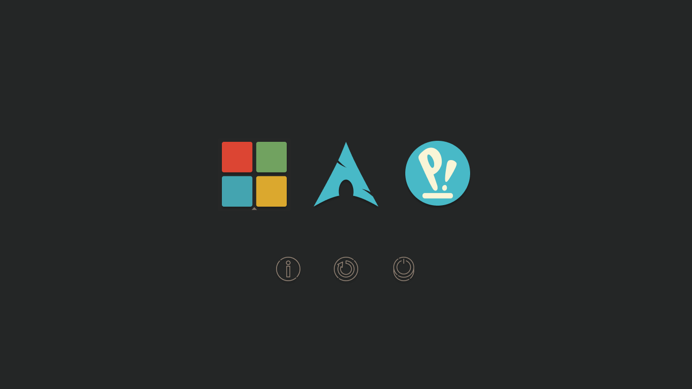

# rEFInd Gruvbox theme

## :star2: About
This is a clean theme for rEFInd based on [Gruvbox](https://github.com/morhetz/gruvbox) palette 

rEFInd is an easy boot manager for computers based on the EFI and UEFI by Roderick W. Smith.

#### More information in the official website

[rEFInd](https://www.rodsbooks.com/refind/)


## :rainbow: Preview

<center></center>

## :wrench: How to install

1. Locate your rEFInd directory. For most systems <code>/boot/efi/EFI/refind</code>
    - Create a folder called <code>themes</code> inside it, if it doesn't already exist 
2. Clone this repository and copy into the <code>themes</code> directory
3. Add <code>include themes/refind-gruvbox-theme/theme.conf</code> at the end of <code>refind.conf</code> on refind directory.

## :pencil2: How to edit

- Background - you can search lines and edit this on <code>theme.conf</code>
```
# Background
banner themes/refind-gruvbox-theme/img/bg2.png
```

## :raising_hand: How to contribute

1. Fork this repository and clone your fork in your system
2. Copy the png icons into the appropriate icons folders
3. Commit, upload your fork and them open a PR

#### :cherries: Icons

1. The icons must be in scheme color [Gruvbox](https://github.com/morhetz/gruvbox) 
2. OS - 128px x 128px 
3. Tools - 48px x 48px
4. Respect the nomeclatures like <code>os_arch</code> for systems and <code>func_about</code> for tools. You can see all names on directory <code>boot/efi/EFI/refind/icons</code>

## :space_invader: Issues

### Icons/Background blurry: 

- You can try disabling CSM and modify to not use a "Legacy" or "Compatibility" mode
- After add your resolution on <code>theme.conf</code> like this

```
# Resolution
resolution 1920 1080
```

## :sparkles: Credits

- Scheme Collor - [Gruvbox](https://github.com/morhetz/gruvbox)
- OS icons (Arch, Debian, Ubuntu, Manjaro, Fedora, Gentoo, MX, Mint, Linux) - [Wikimedia](https://commons.wikimedia.org/wiki/Main_Page) - [SVGRepo](https://www.svgrepo.com)
- Tools icons - [Flaticon](https://www.flaticon.com/) 

-----
<p align="center">Make with :yellow_heart: by Delania Oliveira.</p>